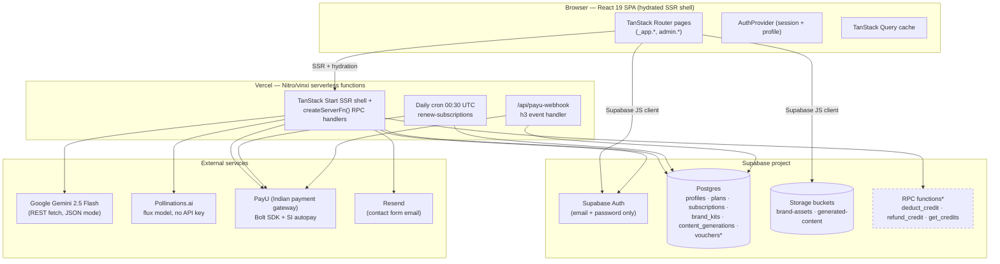
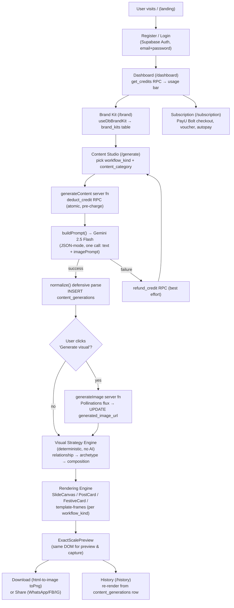
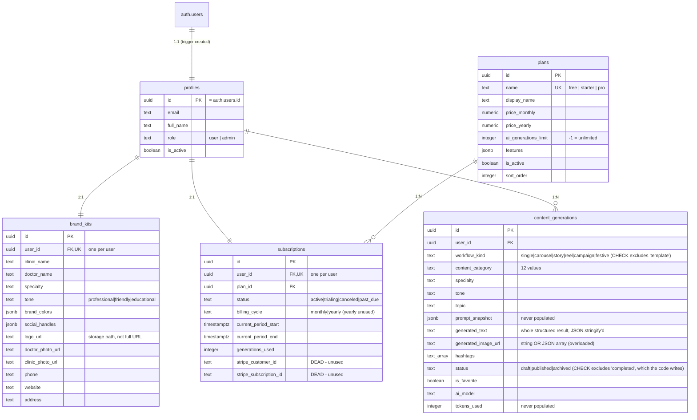
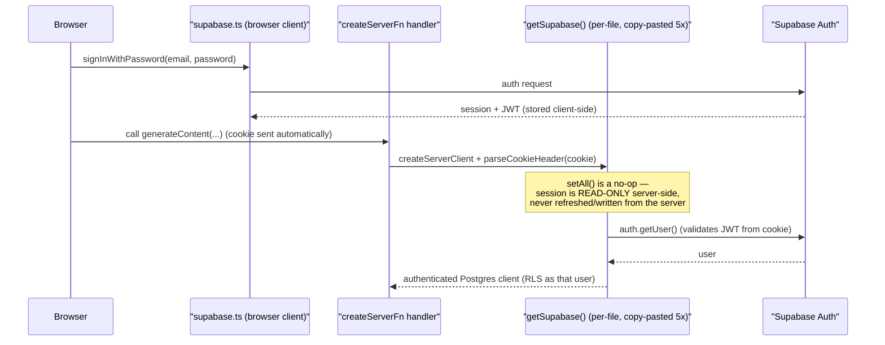
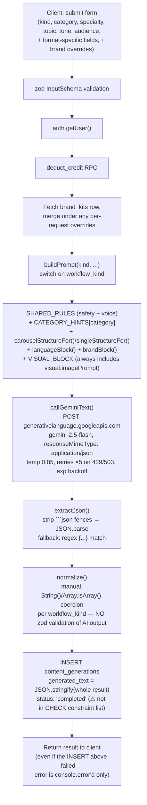
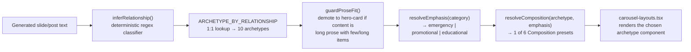
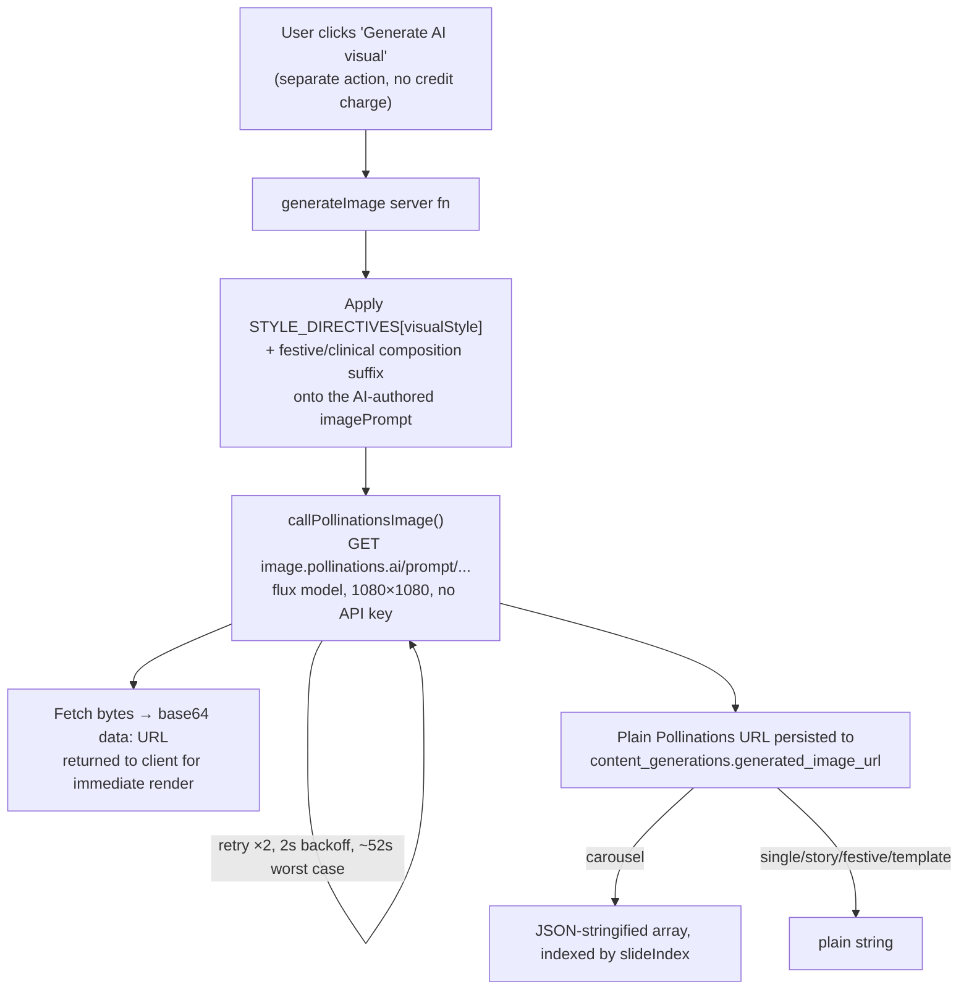

# Medipost AI Studio — Engineering Architecture & Business Logic Document

**Audience:** an experienced engineer who has never seen this codebase and needs to maintain, extend, or rebuild it.
**Scope:** internal engineering reference, not user documentation or API reference.
**Method:** every claim below was derived from reading the actual source in this repository (routes, `src/lib`, `src/lib/api`, `src/components`, `supabase/migrations`) — not from the aspirational `BACKEND_IMPLEMENTATION_SPECIFICATION.md`, which is called out explicitly wherever it disagrees with what is actually built. Where the live production database has diverged from what's checked into `supabase/migrations/`, that is flagged prominently — it is the single most important fact for a new engineer to internalize before touching billing or credits code.

---

## Table of Contents

1. [Executive Overview](#1-executive-overview)
2. [End-to-End System Flow](#2-end-to-end-system-flow)
3. [Business Logic](#3-business-logic)
4. [Database Design](#4-database-design)
5. [Authentication Architecture](#5-authentication-architecture)
6. [Multi-Tenant / Organization Model (There Isn't One)](#6-multi-tenant--organization-model-there-isnt-one)
7. [Credit System](#7-credit-system)
8. [AI Text-Generation Pipeline](#8-ai-text-generation-pipeline)
9. [Visual Strategy Engine](#9-visual-strategy-engine)
10. [Rendering Engine](#10-rendering-engine)
11. [Image Generation](#11-image-generation)
12. [Template / Workflow System](#12-template--workflow-system)
13. [Frontend Architecture](#13-frontend-architecture)
14. [Backend Architecture](#14-backend-architecture)
15. [Server Function ("API") Layer](#15-server-function-api-layer)
16. [Security](#16-security)
17. [Error Handling](#17-error-handling)
18. [Performance](#18-performance)
19. [Folder-by-Folder Walkthrough](#19-folder-by-folder-walkthrough)
20. [Design Decisions](#20-design-decisions)
21. [Known Limitations](#21-known-limitations)
22. [Future Architecture](#22-future-architecture)
23. [Complete Engineer Walkthrough](#23-complete-engineer-walkthrough)

---

## 1. Executive Overview

### Problem & users

Medipost AI Studio is a content-marketing tool for **individual doctors and small clinics in India**. The user is a practitioner (dentist, dermatologist, pediatrician, cardiologist, etc.) who needs a steady stream of Instagram-ready marketing creatives (single posts, carousels, stories, reels scripts, festive greetings, campaign plans) but has no design or copywriting team. The product turns "specialty + topic + tone" into a branded, on-screen, pixel-accurate creative the doctor can download as a PNG and post themselves (or share via WhatsApp/Facebook/Instagram share sheets).

There is **no clinic/team/multi-tenant concept** in the current implementation — every account is one practitioner with one brand kit. See [§6](#6-multi-tenant--organization-model-there-isnt-one).

### Core value proposition

1. Brand once (logo, colors, clinic name, doctor photo) via the Brand Kit.
2. Pick a format (single / carousel / story / reel / campaign / festive) and a content angle (myth-vs-fact, did-you-know, patient FAQ, warning signs, etc.).
3. Gemini writes the copy *and* an image prompt in one call; Pollinations renders the image; a deterministic "visual strategy" engine decides layout/composition without any AI involvement so output is consistent and fast.
4. The result renders through the exact same component tree used for the on-screen preview and the downloadable PNG (`ExactScalePreview` — see [§10](#10-rendering-engine)), so what the doctor sees is what they download.

### High-level architecture



`*` = confirmed to exist only in the **live** Supabase database; there is no corresponding file in `supabase/migrations/`. See [§4](#4-database-design) for the full list of drift.

### Technology stack

| Layer | Technology | Notes |
|---|---|---|
| UI framework | React 19.2 | |
| Meta-framework | TanStack Start 1.167 + Router 1.168 (file-based routing) | SSR + server-functions-as-RPC, replaces a traditional REST/Express layer |
| Build | Vite 8 via `@lovable.dev/vite-tanstack-config` wrapper | Project originated on Lovable.dev; wrapper pre-bundles TanStack Start, React, Tailwind, path aliases, Nitro |
| Server runtime | Nitro 3 (vinxi), Vercel preset, `maxDuration: 60` | 60s raised specifically because Pollinations image generation can take 10–40s |
| Styling | Tailwind CSS v4 + Radix UI (shadcn/ui-style wrappers) | |
| Data fetching | TanStack Query (partial — many reads are ad hoc `useEffect` + direct Supabase calls) | |
| Forms | react-hook-form + zod | |
| Animation | Framer Motion | |
| Backend-as-a-service | Supabase (Postgres, Auth, Storage, RLS) | No Supabase Edge Functions used — TanStack Start server functions are the RPC layer instead |
| Text generation | Google Gemini 2.5 Flash | Plain `fetch()` REST call, no SDK |
| Image generation | Pollinations.ai (flux model) | No API key, no queue |
| Payments | PayU (Bolt SDK checkout + Standing Instruction autopay) | **Not Stripe** — Stripe columns exist in the schema but are dead code |
| Email | Resend | Contact form only |
| PNG export | `html-to-image` (`toPng`) | Chosen over `html2canvas`, which crashes on `oklch()` CSS colors used by shadcn/ui |
| Deployment | Vercel | Daily cron job for subscription renewal |

### Major modules

- **Content Studio** (`/generate`) — the core product surface: pick workflow + category + inputs, generate text, optionally generate an image, preview, download, share.
- **Brand Kit** (`/brand`) — clinic identity used to personalize every generation and every rendered creative.
- **Content History** (`/history`) — browse, re-preview, re-download past generations.
- **Subscription & Billing** (`/subscription`) — plan selection, PayU checkout, voucher codes, autopay.
- **Admin Console** (`/admin/*`) — user management, plan CRUD, voucher CRUD, content analytics, dashboard stats. One page (`admin.settings.tsx`) is non-functional scaffolding.
- **Marketing site** (`/`) — landing page, no business logic beyond a Resend-backed contact form.

---

## 2. End-to-End System Flow

The canonical user journey, and where each step lives in code:



Key deviations from a "typical" SaaS flow, established by direct code reading:

- **Credit is deducted before generation, not after** — `generateContent` calls `deduct_credit` first, then calls Gemini, then refunds on failure. This avoids a race where two concurrent requests both pass a "check quota" step, at the cost of a refund round-trip on every failure.
- **Text and image prompt are produced in the same Gemini call.** There is no separate "generate image prompt" step — the JSON schema Gemini is asked to return always includes a `visual.imagePrompt` field alongside the copy.
- **Image generation is a separate, optional, on-demand step** the user triggers after seeing the text — not part of the atomic generation transaction.
- **Visual layout/composition selection is 100% deterministic** (regex/rule-based in `visual-strategy.ts`), not AI-driven. This is a deliberate design choice — see [§9](#9-visual-strategy-engine) and [§20](#20-design-decisions).
- **The rendering path a workflow takes in the live Studio and in History is not always the same component tree** — see the divergence table in [§10](#10-rendering-engine). This is the single most important "gotcha" for anyone touching rendering code (also captured in project memory as "test changes in the right [rendering] system").

---

## 3. Business Logic

### 3.1 Authentication & account creation

- **Purpose:** let a practitioner sign up and get a working account with zero manual setup.
- **Inputs:** email, password, full name, specialty (captured at registration, stored in `auth.users.raw_user_meta_data`).
- **Business rule:** on `auth.users` insert, a Postgres trigger (`handle_new_user`) creates a matching `profiles` row (`role: 'user'`); a second trigger (`handle_new_subscription`) then fires on `profiles` insert and assigns the `free` plan. **This happens entirely in the database — the application code never has to remember to provision a new user.**
- **Edge case:** if no row named `'free'` exists in `plans` at signup time, the trigger silently does nothing and the user ends up with *no* subscription row at all — `use-subscription.ts` and `get_credits` would then have nothing to join against. Nothing in the app code detects or repairs this.
- **Dependencies:** Supabase Auth, `plans` seed data (`supabase/seed/001_plans.sql`).

### 3.2 Brand Kit

- **Purpose:** capture clinic identity once, apply it to every generation and every rendered creative.
- **Inputs:** clinic name, doctor name, specialty, tagline, tone, target audience, phone/website/address, brand colors (`{primary, secondary, accent}` JSON), social handles, logo/doctor-photo/clinic-photo uploads.
- **Business rule:** one brand kit per account (`UNIQUE user_id` on `brand_kits`). Empty fields render as *nothing* in the final creative (no "Your Clinic Name" placeholder box) — an explicit design decision so a doctor who hasn't filled in their brand kit yet still gets a clean creative rather than one full of placeholder text.
- **Two independent read paths exist**: `useDbBrandKit()` (plain TanStack Query, used by the Brand settings page for editing) and `useBrandKit()` (a bespoke hook with a localStorage cache + DB hydration + cross-tab `CustomEvent` sync, used by every rendering component). See [§7 of the pipeline report / §9](#9-visual-strategy-engine) and the dedicated write-up in [§10](#10-rendering-engine).
- **Validation:** none server-side beyond DB defaults (`brand_colors` defaults to a fixed 3-color JSON); no hex-format or phone-format validation found in code, despite the original spec calling for it.

### 3.3 Content generation

- **Purpose:** produce on-brand marketing copy (and optionally an image) for one of 6 workflow formats.
- **Inputs:** `workflow_kind` (single/carousel/story/reel/campaign/festive — plus a `template` variant), `content_category` (12 possible angles, each tagged with which workflows it's valid for in `mock-data.ts`), specialty, topic, tone, audience, and format-specific extras (festival name/style for festive, slide count 2–10 for carousel, target language).
- **Business rule:** one credit consumed per successful `generateContent` call (see [§7](#7-credit-system)); image generation is a second, independent action with no credit charge coded (confirmed no `deduct_credit` call anywhere in `generateImage`).
- **Validation:** zod `InputSchema` server-side; no client-side pre-check of remaining quota before calling the server (the "no credits" case is discovered only after the server rejects the request).
- **Edge case — schema/constraint mismatch:** the code inserts `status: "completed"` into `content_generations.status`, but the migration's `CHECK` constraint only allows `draft|published|archived`; it also can insert `workflow_kind: "template"`, not in that column's `CHECK` list either. Under the migrations as checked in, **every insert should fail** — since the code swallows the insert error and returns content to the user anyway, the observable symptom is "generation works, but the row never shows up in History." This is strong evidence the live schema's constraints have been loosened outside of version control (see [§4](#4-database-design)).
- **Dependencies:** Gemini 2.5 Flash, `brand_kits`, `subscriptions`/`deduct_credit` RPC, `content_generations`.

### 3.4 Content History

- **Purpose:** let a user browse everything they've generated, re-preview it, re-download it.
- **Business rule:** history is scoped to the authenticated user via RLS (`content_gen_owner_all` policy — `auth.uid() = user_id`); admins get a read-only cross-user policy.
- **Known gap:** History renders **Story** and **Template** posts through different code paths than the live Studio (see [§10](#10-rendering-engine)) — a Story generated and downloaded in the Studio can look visually different when re-opened from History, and a Template post's chosen frame is not persisted at all, so History always shows the first/default frame.

### 3.5 Subscriptions & plans

- **Purpose:** gate feature/volume access by tier (Free / Starter / Pro).
- **Business rule (per seed data):** Free = 10 generations/month, single+story workflows only, no custom branding, 7-day history. Starter = 100 generations/month, all workflows except campaign, custom branding, 90-day history. Pro = unlimited generations, all workflows including campaign, custom branding + priority support, unlimited history. **None of the `features` JSON gating (workflow restrictions, history retention) is actually enforced in application code** — it's descriptive metadata read by nothing; only the numeric `ai_generations_limit` is enforced (via the undocumented `deduct_credit` RPC).
- **Edge case — three sources of truth:** the DB `plans` table (admin-editable via `/admin/plans`), a hardcoded `PLANS` array in `_app.subscription.tsx` (what the user sees priced), and a hardcoded `PLAN_CATALOG` in `payment.functions.ts` (what actually gets charged) are three independent definitions. An admin changing a price or limit in `/admin/plans` has **no effect** on what the pricing page shows or PayU charges.
- **Dependencies:** PayU (payment), `deduct_credit`/`refund_credit`/`get_credits` RPCs (usage), the daily renewal cron (autopay only, not usage reset — see [§7](#7-credit-system)).

### 3.6 Vouchers

- **Purpose:** percentage-discount codes, admin-issued, plan-restricted.
- **Business rule:** a voucher is valid if `is_active`, not expired, and `used_count < max_uses`. Discount is computed twice — client-side for display, server-side (authoritative, inside `createPayUHash`) for the actual charge — so a tampered client-side price can never reach PayU.
- **Edge case — non-atomic redemption:** `used_count` is incremented via a `SELECT` then `UPDATE` in `payment.functions.ts`, not an atomic `UPDATE ... SET used_count = used_count + 1`. Two concurrent redemptions near the `max_uses` ceiling can both pass validation and both increment, overshooting the cap. This is a **real, verifiable bug**, unlike the credit-deduction RPC which is architecturally safe (single round-trip).
- **Dependencies:** `vouchers` table (exists live, **no migration file** — see [§4](#4-database-design)).

### 3.7 Admin operations

See [§14](#14-backend-architecture) for the full breakdown of which admin surfaces are real (dashboard stats, user list+delete, plan CRUD, voucher CRUD, content analytics) versus non-functional scaffolding (`admin.settings.tsx` — a Save button with no handler at all).

---

## 4. Database Design

### 4.1 What's actually in version control

All 8 files in `supabase/migrations/` plus `supabase/seed/001_plans.sql`:



Also defined: `storage.buckets` rows for `brand-assets` (5 MB, images only, private) and `generated-content` (10 MB, images only, private), each with owner-scoped and admin-read RLS policies keyed off the user-id path segment in the object name; a shared `handle_updated_at()` trigger function used by every table's `updated_at` column.

### 4.2 What exists only in the live database (schema drift — read this before touching billing code)

Confirmed by grepping the entire `src/` tree for column/table/function names that code reads or writes but that appear nowhere in `supabase/migrations/`:

| Object | Where it's used in code | Status |
|---|---|---|
| `subscriptions.plan` (text) | `use-subscription.ts`, `admin.functions.ts` | Added via out-of-band `ALTER TABLE` |
| `subscriptions.plan_expires_at` | `use-subscription.ts`, `payment.functions.ts` | Added via out-of-band `ALTER TABLE` |
| `subscriptions.payu_txn_id` / `payu_payment_id` / `payu_subid` | `payment.functions.ts:174-184` | Added via out-of-band `ALTER TABLE`; comment in-code self-acknowledges this |
| `subscriptions.auto_renew` / `next_billing_date` | `payment.functions.ts`, `api/cron/renew-subscriptions.ts` | Added via out-of-band `ALTER TABLE` |
| `vouchers` table (code + discount_percentage + applicable_plans[] + max_uses + used_count + expires_at + is_active) | `voucher.functions.ts`, `payment.functions.ts` | **No migration file at all** |
| RPC `deduct_credit(p_user_id)` | `generate.functions.ts:773` | No `CREATE FUNCTION` anywhere in repo |
| RPC `refund_credit(p_user_id)` | `generate.functions.ts:810` | No `CREATE FUNCTION` anywhere in repo |
| RPC `get_credits(p_user_id)` | `_app.dashboard.tsx` | No `CREATE FUNCTION` anywhere in repo |

**Implication for a new engineer:** `supabase/migrations/` is not a reliable source of truth for the production schema. Before writing new migrations, dump the live schema (`supabase db dump` or the dashboard's schema view) and diff it against what's checked in, or new migrations risk conflicting with columns/functions that already exist. This is the single highest-value fix an incoming engineer could make (backfilling the missing migrations + RPC definitions into version control).

### 4.3 Indexing & constraints

`content_generations` is the highest-cardinality table and is indexed accordingly: `(user_id, created_at DESC)` for the primary History query, plus separate `(user_id, workflow_kind)`, `(user_id, specialty)`, `(user_id, status)`, and a **partial** index `(user_id, is_favorite) WHERE is_favorite = true` for the favorites filter. `subscriptions` has partial unique indexes on `stripe_customer_id`/`stripe_subscription_id` (`WHERE ... IS NOT NULL`) — vestigial, since nothing writes those columns.

### 4.4 RLS pattern (consistent across every table)

Every table follows the same two-policy shape: an **owner policy** (`auth.uid() = user_id`, `FOR ALL`, so a user can read/write only their own rows) and an **admin policy** (`EXISTS (SELECT 1 FROM profiles WHERE id = auth.uid() AND role = 'admin')`, either read-only or `FOR ALL` depending on the table). `plans` is the exception — publicly readable (`USING (true)`), admin-writable. This means **authorization logic is enforced at the database layer**, not just in application code — a real security strength, though it also means the undocumented `deduct_credit`/`refund_credit`/`get_credits` RPCs must be `SECURITY DEFINER` (or the RLS `subscriptions_owner_read`-only policy would block a client-role caller from updating `generations_used` at all) — another reason those functions matter enough to get version-controlled.

---

## 5. Authentication Architecture

### 5.1 Method

Email + password only, via Supabase Auth. No OAuth providers, no magic links, despite this being common in comparable products. `supabase.auth.signUp()` carries `full_name`/`specialty` in `options.data`, which lands in `auth.users.raw_user_meta_data` and is read by the `handle_new_user` trigger (`profiles.full_name`).

### 5.2 Client vs. server Supabase clients



- **Browser**: one module-level singleton (`src/lib/supabase.ts`), `createBrowserClient` from `@supabase/ssr`.
- **Server**: **no shared helper module exists.** Every server-function file (`generate.functions.ts`, `payment.functions.ts`, `voucher.functions.ts`, `admin.functions.ts`, `admin.plans.tsx`) independently redefines an identical `getSupabase()` — copy-pasted boilerplate, not factored out. Flagged in [§21](#21-known-limitations) as a real maintenance risk (a bug fix to cookie parsing has to be applied in 5 places).
- **No SSR auth hydration**: there is no `getUser()` call in the root route loader and no auth state passed through router context. `src/server.ts`/`src/start.ts` contain zero Supabase client code — they're pure TanStack Start server-entry/error-handling wrappers. Auth state is 100% resolved client-side after hydration; each `createServerFn` independently re-derives `user` from the request cookie on every call. This means there's a brief window on every page load where the client doesn't yet know if it's authenticated.

### 5.3 Session lifecycle (`src/lib/auth-context.tsx`)

Deliberately two-phase, with an inline comment explaining the race it avoids:

1. Effect 1: `supabase.auth.getSession()` (awaits token refresh) *before* trusting `onAuthStateChange`'s `INITIAL_SESSION` event — otherwise an expired-but-refreshable token could cause a false-negative redirect to `/login`.
2. Effect 2: fetches the `profiles` row **only after** `session.user.id` is set, deliberately decoupled from the `onAuthStateChange` callback itself, because a DB read triggered directly inside that callback can race ahead of the JWT actually committing, causing `auth.uid()` to resolve `null` inside RLS and the read to silently return nothing.

### 5.4 Route protection — client-side only, no `beforeLoad` guards

Every protected route relies on a `useEffect` + `navigate()` redirect inside a shell component, not TanStack Router's `beforeLoad`:

- `AppShell` (`src/components/app-shell.tsx`): if `!loading && !session`, redirect to `/`. Renders `null` while resolving to avoid a content flash.
- `AdminShell` (`src/components/admin-shell.tsx`): if `!loading && !session`, redirect to `/admin/login`; **additionally** renders an "Unauthorized Access" panel if `session && profile.role !== "admin"`.
- `admin.login.tsx` re-checks role after sign-in and force-signs-out non-admins.
- `admin.vouchers.tsx` independently re-implements the same admin-role check a third time in its own `useEffect`.

**Server-side, the real enforcement is `assertAdmin()`** inside each admin `createServerFn` handler (also copy-pasted per file) plus RLS at the database layer — the client-side redirects are UX convenience, not the security boundary. A non-admin who somehow reaches an admin page client-side still cannot read/write admin-only data, because RLS and `assertAdmin()` both independently block it.

### 5.5 Password reset

`forgot-password.tsx` → `supabase.auth.resetPasswordForEmail(email, {redirectTo: origin + "/reset-password"})`. `reset-password.tsx` picks up the recovery token via `supabase.auth.getSession()` (the Supabase SDK auto-parses it from the URL hash), then `supabase.auth.updateUser({password})`, then redirects to `/login` after 3s. No password-strength validation found beyond whatever Supabase Auth enforces by default.

### 5.6 Dead code

`src/lib/auth-mock.ts` — a localStorage-based role stub, header comment: *"Mock role-based auth for demo. Replace with Lovable Cloud auth later."* Zero import sites anywhere in `src/`. Safe to delete; harmless as-is.

---

## 6. Multi-Tenant / Organization Model (There Isn't One)

A generic healthcare-SaaS architecture doc would normally have a section on organization/clinic isolation, ownership, and team permissions. **This codebase has none of that.** There is no `organizations` or `clinics` table, no team/seat concept, no invitation flow. The isolation boundary is simply **one Supabase Auth user = one `profiles` row = one `brand_kits` row = one `subscriptions` row**, enforced entirely by row-level `auth.uid() = user_id` RLS policies (see [§4.4](#44-rls-pattern-consistent-across-every-table)).

This is a deliberate MVP scoping choice, not an oversight — the seed data's `pro` plan even includes a `"max_team_members"`-shaped feature flag in the original spec's seed JSON, but the live seed (`supabase/seed/001_plans.sql`) drops that field entirely, and no code anywhere reads or enforces a team-member limit. If/when multi-doctor clinic accounts become a real requirement, this is a schema-level addition (an `organizations` table, an `organization_id` FK threaded through `brand_kits`/`subscriptions`/`content_generations`, and RLS policies rewritten from `auth.uid() = user_id` to an organization-membership subquery) — see [§22](#22-future-architecture).

---

## 7. Credit System

This is the most consequential system in the app to get right, and the one with the most undocumented surface area.

### 7.1 Deduction flow

```mermaid
sequenceDiagram
    participant User
    participant ServerFn as "generateContent (createServerFn)"
    participant RPC as "deduct_credit RPC*"
    participant Gemini
    participant DB as "content_generations"
    participant RefundRPC as "refund_credit RPC*"

    User->>ServerFn: submit generation request
    ServerFn->>ServerFn: supabase.auth.getUser()
    ServerFn->>RPC: rpc("deduct_credit", {p_user_id})
    alt insufficient credits
        RPC-->>ServerFn: error "INSUFFICIENT_CREDITS"
        ServerFn-->>User: "Credits exhausted. Please upgrade."
    else no active subscription row
        RPC-->>ServerFn: error "SUBSCRIPTION_NOT_FOUND"
        ServerFn-->>User: "No active subscription found."
    else success (generations_used incremented atomically)
        RPC-->>ServerFn: ok
        ServerFn->>Gemini: buildPrompt() → callGeminiText()
        alt Gemini call throws
            Gemini-->>ServerFn: error
            ServerFn->>RefundRPC: rpc("refund_credit", {p_user_id}) — best effort, errors swallowed
            ServerFn-->>User: generation failed, credit refunded
        else Gemini succeeds
            Gemini-->>ServerFn: JSON text
            ServerFn->>DB: INSERT content_generations (best-effort; failure is logged, not surfaced)
            ServerFn-->>User: generated content (returned even if the INSERT failed)
        end
    end
```

`*` = RPC exists only in the live database — not in `supabase/migrations/`.

**Why pre-charge-then-refund instead of check-then-charge:** a single `rpc()` round trip is architecturally the correct way to avoid a check-then-update TOCTOU race across concurrent requests from the same user — as long as the function body itself performs an atomic `UPDATE ... WHERE generations_used < limit`. That internal correctness **cannot be verified from this repository** because the function isn't version-controlled; it's flagged here as an explicit trust dependency on the live database, not a confirmed fact.

### 7.2 Reading remaining quota — two independent, unsynchronized paths

| Surface | Mechanism | File |
|---|---|---|
| Dashboard usage bar | `rpc("get_credits", {p_user_id}).single()` → `{generations_used, ai_generations_limit, credits_remaining}` | `_app.dashboard.tsx` |
| Subscription page banner | Plain `SELECT` on `subscriptions` joined to `plans`, computed client-side | `use-subscription.ts`, `_app.subscription.tsx` |

Both should agree, but nothing enforces that they do, and there's a **known display bug**: the subscription page's "X / 10 posts used" line is hardcoded to `/10` (not the plan's actual `ai_generations_limit`), and is only shown for `!isPro` — so a Starter-plan user (limit 100) would see a `/10` denominator if this code path is reached for them. This is a real bug, confirmed by reading the literal source, not a hypothetical.

### 7.3 Monthly reset — not implemented

The `subscriptions.generations_used` column comment claims *"Reset to 0 on period rollover via backend cron or Stripe webhook"* — this is aspirational. The **only** cron job in the codebase (`api/cron/renew-subscriptions.ts`, daily 00:30 UTC) handles PayU Standing-Instruction billing renewal exclusively; it never touches `generations_used`. No other scheduled job, Edge Function, or reset call exists anywhere in the repository. **A user who exhausts their monthly quota stays exhausted indefinitely** unless something resets the counter at the database level outside of this codebase (possibly inside the undocumented `deduct_credit`/`get_credits` bodies, but that cannot be confirmed here). This is the single most important functional gap to flag to product/ops.

### 7.4 Quota enforcement UX

Entirely reactive, not proactive: there is no client-side "you have 0 credits left, button disabled" check anywhere before calling `generateContent`. The user experiences hitting the limit as a failed generation with an error toast, not a pre-emptive upsell.

### 7.5 Race conditions summary

| Operation | Atomic? | Evidence |
|---|---|---|
| Credit deduction (`deduct_credit`) | Presumed yes (single RPC round trip in app code) | Cannot verify function internals — not version-controlled |
| Voucher `used_count` increment | **No** — confirmed TOCTOU | `payment.functions.ts`: `SELECT ... used_count` then `UPDATE ... used_count + 1` as two separate statements |

---

## 8. AI Text-Generation Pipeline

**File:** `src/lib/api/generate.functions.ts` (~960 lines). Two `createServerFn` handlers: `generateContent` and `generateImage` (image generation covered separately in [§11](#11-image-generation)).



### 8.1 Prompt construction (`buildPrompt`)

A `switch` over `kind` (single/carousel/story/reel/campaign/festive/template) assembles `{system, user}` strings from shared building blocks:

- **`SHARED_RULES`** — a constant block of content-safety + editorial-voice instructions applied to every generation.
- **`CATEGORY_HINTS`** — 12 per-category tone/structure instructions (one per `content_category` value: educational, myth-fact, did-you-know, patient-faq, health-tips, warning-signs, prevention, doctor-explains, awareness, clinic-promo, greeting, reel-hook).
- **`carouselStructureFor()` / `singleStructureFor()`** — category-specific rendered-template contracts. Example: the `myth-fact` category must return exactly two `\n\n`-separated paragraphs prefixed `Myth: ` / `Fact: `, because the client-side renderer (`ComparisonSplit` in `carousel-layouts.tsx`) parses that literal structure to build the split-panel layout — the AI's output format is itself part of the rendering contract, not free text.
- **`languageBlock()`** — for non-English generations, keeps structural markers (`Myth:`/`Fact:`, JSON field names) in English while translating the copy, so downstream parsing still works regardless of target language.
- **`brandBlock()`** — injects clinic name/doctor name/colors into the prompt so Gemini can naturally reference the brand in copy.
- **Visual block variants** (`VISUAL_BLOCK` / `FESTIVE_VISUAL_BLOCK` / `TEMPLATE_VISUAL_BLOCK`) — each asks for a `visual.imagePrompt` field tailored to the format (festive: mood/decor, not clinical scenes, leave lower-third calm for text overlay; template: single subject-centered photo with no embedded text since it'll be masked into a shape by `template-frames.tsx`).

### 8.2 The Gemini call itself

Plain `fetch()` to `https://generativelanguage.googleapis.com/v1beta/models/gemini-2.5-flash:generateContent?key=<GEMINI_API_KEY>` — **no `@google/genai` SDK dependency**. `generationConfig.responseMimeType: "application/json"` is the entire "schema enforcement" mechanism (Gemini's JSON mode, not function-calling/structured-output schemas). `temperature 0.85, topK 40, topP 0.95, maxOutputTokens 8192`. Safety thresholds: harassment/hate/sexual blocked at MEDIUM, dangerous-content only at HIGH. Retries up to 5 times with exponential backoff (`1000 × 2^(attempt−1)` ms), but only for HTTP 429/503 — any other error (400, auth failure, etc.) throws immediately with a status-specific message.

### 8.3 Parsing & validation

`extractJson()` strips markdown code fences and `JSON.parse`s; on failure, falls back to a `{...}` regex match. **There is no zod (or any) schema validation of the AI's returned JSON shape.** Instead, a hand-written `normalize()` function coerces every expected field with `String(x ?? "")` / `Array.isArray(x) ? x : []` per `kind`, so a malformed or missing field degrades to an empty string/array rather than throwing — a defensive-by-coercion strategy rather than defensive-by-rejection.

### 8.4 Persistence quirks

- The entire structured result object is `JSON.stringify`'d into the single `generated_text` text column — not split into typed columns.
- `prompt_snapshot` and `tokens_used` columns exist in the schema (with comments describing their intended use for debugging/replay and cost attribution) but **are never written by the code**.
- The insert writes `status: "completed"`, which is not in the `content_generations.status` CHECK constraint (`draft|published|archived`) as checked into migrations — see [§4.2](#42-what-exists-only-in-the-live-database-schema-drift--read-this-before-touching-billing-code) for why this implies live-schema drift.
- **Save failure is non-fatal to the user**: `if (saveError) console.error(...)` — the generated content is returned to the client regardless, so a user can see and download content that was never actually persisted to their History.

---

## 9. Visual Strategy Engine

**File:** `src/lib/visual-strategy.ts` (~267 lines). Its own header comment documents the pipeline: **Generated Content → Relationship Detection → Visual Strategy → Composition → Illustration → Layout → Renderer.** Everything in this file is deterministic (regex/rule-based) — no AI call is involved in choosing layout.



### 9.1 `inferRelationship()` — priority-ordered classification

The AI's own `relationship` hint (a field the JSON schema optionally asks Gemini for) is used **only as a last-resort tie-breaker**, specifically so rows generated before that field existed in the schema still classify correctly. The real, primary classifier runs in this priority order: FAQ (question mark, or `patient-faq` category) → statistic pattern (`%`, "1 in 3", "2x") → comparison words (`vs`, `myth...fact`) → warning words / `warning-signs` category → sequence pattern (`Step 1`) → timeline words (day/week/month N, before/after) → hierarchy words ("types of", "categories") → item-count heuristic (≥3 split items → `checklist` if imperative or `prevention`, else `list`) → fallback `single`.

Two separate content-splitting functions are deliberately kept apart: `splitContentItems()` (line-break/semicolon/`word,Word` split) drives *classification* (how many items exist), while `splitContentItemsForLayout()` adds a sentence-boundary fallback used only for *rendering* — so the sentence-splitting heuristic used to chip a flowing paragraph into a grid can never accidentally change what relationship gets inferred for the same content.

### 9.2 Archetype, emphasis, and composition resolution

- `ARCHETYPE_BY_RELATIONSHIP` maps each relationship 1:1 to a layout archetype (e.g. `statistic → statistic-hero`, `comparison → comparison-split`, `faq → faq-card`, `hierarchy → radial-diagram`).
- `guardProseFit()` demotes item-chip archetypes (icon-grid, checklist, process-flow, timeline, radial-diagram) back to `hero-card` when content is long prose with few, long "items" (average item length > 110 chars over total content > 220 chars) — because the sentence-boundary fallback in `splitContentItemsForLayout` would otherwise chop mid-thought prose into an ugly chip grid. `callout-diagram` is explicitly exempted from this demotion since it already renders full prose regardless.
- `resolveEmphasis()` maps category to `emergency` (warning-signs), `promotional` (clinic-promo, awareness), or `educational` (default); `emergency` unconditionally forces the `poster` composition regardless of what archetype was chosen.
- `resolveComposition()` combines archetype + emphasis into one of 6 `Composition` presets from `design-tokens.ts` (`hero-left`, `hero-center`, `balanced`, `poster`, `infographic`, `split-focus`).

### 9.3 Single posts are category-first, not content-inferred

A single post has no slide sequence to infer structure from, so `SINGLE_POST_ARCHETYPE_BY_CATEGORY` **hard-codes** the archetype per category instead — myth-fact → comparison-split, did-you-know → statistic-hero, patient-faq → faq-card, health-tips/prevention → checklist, warning-signs → callout-diagram. This is an explicit design decision documented in the file's own comments: for a single post, the user's chosen category *is* the design promise; content-based inference is reserved as the fallback only for uncategorized content.

---

## 10. Rendering Engine

This is the section where the project-memory guidance *"which rendering system each format uses differs — test changes in the right one"* is most concrete. Confirmed by direct code reading: **the live Studio and the History viewer render the same underlying `content_generations` row through genuinely different component trees for some formats**, and this is a real, currently-shipping divergence — not a hypothetical risk.

### 10.1 Rendering pipeline per workflow

| `workflow_kind` | Studio component (`_app.generate.tsx`) | History viewer (`_app.history.tsx`) | Consistent? |
|---|---|---|---|
| `single` | `SinglePostPreview` → `SlideCanvas` | `SlideCanvas` directly | ✅ Same engine |
| `carousel` | `CarouselPreview` → `SlideCanvas` per slide | `SlideCanvas` per slide | ✅ Same engine |
| `story` | `StoryPreview` — bespoke inline JSX, 9:16 gradient card | `PostCard` — a **different**, Instagram-post-styled component | ❌ **Divergent** — a Story can look different in History than what was downloaded from the Studio |
| `festive` | `FestivePreview` → `FestiveCard` | `FestiveCard` (same component) | ✅ Same |
| `template` | `TemplatePreview` → one of 10 named frames in `template-frames.tsx` | `getTemplateFrame(null)` — **always the first/default frame** | ⚠️ Partially divergent — the frame the user actually picked is never persisted, so History can't reproduce it |
| `reel` | `ReelPreview` — text-only (hook + talking points list) | text fields only | Text-only both sides, no canvas divergence risk |
| `campaign` | `CampaignPreview` — text-only (weekly schedule table) | text fields only | Text-only both sides |

### 10.2 `SlideCanvas` — the shared engine for single + carousel

`SlideCanvas` is a `switch` over 15 `SlideLayout` values: 5 **legacy** hand-tuned layouts (`CenteredLayout`, `ImageLeftLayout`, `FullImageLayout`, `SplitLayout`, `ModernCardLayout` — forced into `FullImageOverlayLayout` whenever a photo is present) and 10 **content-driven archetypes** from [§9](#9-visual-strategy-engine) (`HeroCard`, `IconGrid`, `Checklist`, `StatisticHero`, `ComparisonSplit`, `ProcessFlow`, `Timeline`, `FaqCards`, `CalloutDiagram`, `RadialDiagram`), all implemented in the single 900-line `src/components/carousel-layouts.tsx`. A single post is literally `SlideCanvas` invoked with `totalSlides: 1, isCta: true` — there is no separate single-post rendering component underneath the preview wrapper.

Every archetype has an explicit photo-aware branch: when `imageUrl` is present, text/chip colors swap to white-on-photo with a text-shadow and opaque chip backgrounds (`photoTheme()`/`photoText()`/`PHOTO_CHIP_BG` helpers), because `SlideCanvas` paints the AI-generated photo plus a dark gradient scrim behind these components before the archetype renders its content on top.

### 10.3 Design system inputs

- **`design-tokens.ts`** (~98 lines) — explicitly scoped to the 10 new archetypes only; the 5 legacy layouts deliberately do not consume it, "so nothing already shipping changes" (a direct quote from the file's own header comment). Provides a 6-role type scale, spacing/radius/shadow tokens at 1080×1080 canvas scale, an illustration style contract (stroke width 1.75, max 2 colors + white, rounded corners), and the 6 `Composition` presets ([§9.2](#92-archetype-emphasis-and-composition-resolution)) each specifying illustration placement, content density, reading direction, and a whitespace multiplier.
- **`carousel-themes.ts`** (~192 lines) — an older, separate color/typography theme system that predates `design-tokens.ts`: 6 hard-coded named themes (Clinical Blue, Dental Premium, Modern Healthcare, Pediatric Friendly, Luxury Aesthetic, Minimal Professional), a specialty→icon-set map, and `suggestThemeId()` (heuristic default theme by specialty). Its `generateSlideImage()` function is dead stub code predating the real Pollinations pipeline — always returns `null`.
- **`illustrations/index.tsx`** — 12 hand-authored 2-color SVG line-art icons (heart, brain, lungs, kidney, tooth, glucose-meter, stethoscope, etc.); `illustrationFor()` resolves specialty + topic + category to one icon via category override first, then topic-keyword regex, then a specialty default table.

### 10.4 Brand data into rendered creatives vs. into the template picker

`BrandHeader`/`BrandFooter`/`BrandContactBar` (used inside the actual generated creative) render **nothing** for empty fields — no placeholder box — an explicit design decision so an incomplete brand kit still yields a clean creative. `template-frames.tsx`'s `LogoSlot`/`ContactBar` do the opposite, but **only inside the frame-picker gallery**: a `placeholders` prop shows "Your Logo" / "Business Name" / "Mobile Number" chips purely so an empty gallery preview still communicates what each slot is for; the real generated creative never receives that prop, so it stays clean.

### 10.5 `ExactScalePreview` — why preview and download are pixel-identical

`ExactScalePreview` (`CREATIVE_DESIGN_WIDTH = 540`) measures its host container's width via `ResizeObserver`, computes `scale = clientWidth / 540`, and renders children at a **fixed 540px width** with a CSS `transform: scale()`. This is the mechanism by which the on-screen Studio preview, the History dialog preview, and the off-screen capture copy used for PNG export (see [§10.6](#106-download--png-export)) all render the exact same DOM at the exact same logical size, just visually scaled differently by CSS. `template-frames.tsx`'s own doc comment states this directly: frames "must render through `ExactScalePreview` ... so the preview stays pixel-identical to the 1080×1080 download."

### 10.6 Download / PNG export

Library: `html-to-image`'s `toPng()`, chosen explicitly over `html2canvas` because `html2canvas` crashes on `oklch()` CSS color functions used throughout shadcn/ui's Tailwind v4 setup.

**Three separate, non-unified capture code paths exist**, with no shared abstraction despite a hook already existing for exactly this purpose:

1. **`src/hooks/useDownloadPost.ts`** — `pixelRatio: 2` (retina via DPR multiplier), white background. Used only by `FestivePreview`.
2. **Inline `toPng` calls directly inside `_app.generate.tsx`** for Single/Carousel/Story/Template — `pixelRatio: 1` with a fixed `canvasWidth`/`canvasHeight` (1080×1080, or 1080×1920 for Story) instead of the DPR-multiplier approach. These render an **off-screen, full-size (540px design-width) hidden copy** of the creative purely for capture (`left: -10000`), distinct from the visible, CSS-scaled `ExactScalePreview` copy — because `toPng`'s fixed canvas dimensions need an untransformed 540px source DOM to rasterize cleanly at 1080px; capturing the already-`transform: scale()`d visible copy directly would not produce the right pixel dimensions.
3. **`useCardDownload()`, inlined in `_app.history.tsx`** — a third, near-duplicate of hook #1 (`pixelRatio: 2`), plus a CORS workaround the other two don't need: before capture, it finds the card's ``, fetches the remote Pollinations URL and swaps `img.src` to a `data:` URL if it isn't already one, captures, then restores the original `src` — necessary because History's images are remote URLs (not already-inlined `data:` URLs like a freshly-generated Studio image can be), and `toPng` cannot rasterize a cross-origin-tainted canvas otherwise.

### 10.7 Sharing (`src/components/ShareButtons.tsx`)

- **WhatsApp**: on mobile with `navigator.share` available, decodes a `data:` image URL directly via `atob()` into a `Blob` (no `fetch()` — this is the fix behind the "decode data URL directly for WhatsApp image share" commit; some mobile browsers fail to `fetch()` a `data:` URL) and shares it as a `File`; falls back to `fetch()` only for remote (non-`data:`) URLs. Desktop, lacking `navigator.share`, always falls back to WhatsApp Web with **text only** — no image path exists there at all.
- **Facebook / Instagram**: neither platform accepts a programmatic image push from a web app, so the flow copies the caption to the clipboard and auto-downloads the image in parallel (`Promise.all` — this is the "auto-download image on FB/IG share" fix), then shows a status checklist and an "Open Facebook/Instagram →" button that opens the platform's homepage; the user manually uploads the already-downloaded image and pastes the already-copied caption. Falls back to `window.open(imageUrl)` in a new tab if the download itself throws.

### 10.8 Brand Kit hydration for rendering (`src/lib/brand-kit.ts`)

`useBrandKit()` — the hook consumed by rendering components (distinct from `useDbBrandKit()`, the plain TanStack Query hook used only by the Brand *editing* page) — **self-hydrates directly from the `brand_kits` table**, confirming the project-memory note that no GeneratePage-owned prop-drilling bridge remains:

1. On mount / auth-state-change, resolves `userId`.
2. Synchronously reads a per-account localStorage cache (`medipost.brandkit.v1:{userId}`) for instant paint.
3. Fires a DB hydration query in parallel, merging DB values into the cache — **only overwriting fields the DB has a non-empty value for**, so a doctor leaving a field blank in the DB doesn't blank out what's cached, but also never invents placeholder text.
4. Writes the merged result back to localStorage and dispatches a `"brandkit:change"` `CustomEvent`, which every other mounted `useBrandKit()` instance on the page listens for — this is how a save in one component propagates to sibling components (e.g. the live preview and the studio controls) without a shared global store or Context.
5. A 3-second per-user dedup guard prevents the burst of `useBrandKit()` instances that mount simultaneously across a page from each independently re-hydrating from the DB.
6. `stripLegacyDummies()` strips any cached field that still exactly matches an old seeded sample identity ("Dr. Rhea Patel", "Bright Smile Dental Studio") — a migration guard against early-version caches showing fake identity data on real creatives.

---

## 11. Image Generation

Confirmed provider: **Pollinations.ai**, not Gemini/Imagen/DALL-E/Stable Diffusion — despite `carousel-themes.ts` containing unused scaffolding (`AiImageProvider = "gemini" | "imagen" | "dall-e"`, a stub `generateSlideImage()` that always returns `null`) suggesting a different provider was originally planned.



- **Retry budget is deliberately tight**: 2 attempts, 2s fixed backoff — a code comment explains the arithmetic explicitly ("2 attempts × 25s fetch + 2s backoff ≈ 52s worst case") to stay under Vercel's 60s function limit (the reason `vite.config.ts` sets `vercel.functions.maxDuration: 60` in the first place).
- **`generated_image_url` is an overloaded column**: a plain string for single/story/festive/template workflows, but a JSON-stringified array (indexed by slide) for carousels — parsed defensively by callers (`parseSlideImages()` in the History route).
- **Doctor photos are not AI-generated**: the doctor's real photo (from Brand Kit) is composited as a separate client-side layer on top of the AI scene — never sent to or produced by the image model.
- **Festive images** are explicitly directed away from clinical scenes (`FESTIVE_VISUAL_BLOCK` asks for festival decor/mood, with the lower third kept calm for a greeting + doctor-photo overlay); **template images** ask for a single, cleanly-cropped, subject-centered photo with no embedded text or logos, because it will be masked into a shape (hex/arch/circle) by `template-frames.tsx`.
- **No image queue or job table**: generation is fully synchronous within the request/response cycle — no polling, no background worker, no retry-later mechanism beyond the immediate 2 attempts.
- **Fallback on failure**: a toast error; `SlideCanvas`/`FestiveCard` simply render without an image (gradient/icon background via the illustration system), while `PostCard` (History's Story renderer) uses a completely separate fallback strategy — a deterministic Unsplash stock photo chosen by hashing the post title.

---

## 12. Template / Workflow System

Six user-facing workflow formats plus a `template` variant, each with distinct content shape and rendering behavior (full detail in [§10](#10-rendering-engine)):

| Workflow | Purpose | Content shape | Rendering |
|---|---|---|---|
| **Single** | One branded post | Title + body + hashtags + optional image | `SlideCanvas` (1 slide) |
| **Carousel** | 2–10 slide sequence | Array of slides, each classified by `visual-strategy.ts` | `SlideCanvas` per slide |
| **Story** | 9:16 vertical, ephemeral-style | Short hook + body | Bespoke `StoryPreview` in Studio; **different** `PostCard` in History |
| **Reel** | Video script | Hook + talking points list | Text-only, no canvas |
| **Campaign** | Multi-day content plan | Weekly schedule table | Text-only, no canvas |
| **Festive** | Festival greeting | Greeting text + festival-specific image | `FestiveCard` (consistent both sides) |
| **Template** | Pick from 10 named visual frames (hex/arch/circle masks etc.) | Single subject photo + brand overlay | `template-frames.tsx`; frame choice **not persisted**, History always shows the default frame |

Selection logic for content angle (`content_category`) is workflow-aware: `mock-data.ts` tags each of the 12 categories with a `bestFor: WorkflowKind[]` list, driving which categories the Studio UI offers for a given workflow. Actual layout/archetype selection within a workflow is handled entirely by the deterministic Visual Strategy Engine ([§9](#9-visual-strategy-engine)) — the AI is never asked to choose a layout, only to produce text (and an image prompt) matching a category-specific structural contract.

---

## 13. Frontend Architecture

### 13.1 Runtime model

TanStack Start (SSR framework) + TanStack Router (file-based routing) + Vite 8, deployed to Vercel via the Nitro `vercel` preset. `createServerFn()` is the app's entire RPC layer — a code comment in `example.functions.ts` states this is used **instead of** Supabase Edge Functions for all server-side business logic. Handler bodies run server-only; anything imported only inside a handler is tree-shaken out of the client bundle. `src/lib/config.server.ts` uses the `.server.ts` filename convention to guarantee a module never reaches the client bundle at all (used for server-only env access).

### 13.2 Route tree

```mermaid
graph TD
    Root["__root.tsx<br/>QueryClientProvider → AuthProvider → Toaster<br/>+ branded 404 / error pages"]
    Root --> Public["Public routes"]
    Root --> AppLayout["_app.tsx (pathless layout)<br/>renders AppShell"]
    Root --> AdminRoutes["admin.* (flat routes,<br/>each wraps AdminShell individually)"]
    Root --> Api["api/* (h3 handlers, not React)"]

    Public --> P1["index.tsx — /  (landing)"]
    Public --> P2["login.tsx — /login"]
    Public --> P3["register.tsx — /register"]
    Public --> P4["forgot-password.tsx"]
    Public --> P5["reset-password.tsx"]

    AppLayout --> A1["_app.dashboard.tsx — /dashboard"]
    AppLayout --> A2["_app.generate.tsx — /generate"]
    AppLayout --> A3["_app.brand.tsx — /brand"]
    AppLayout --> A4["_app.history.tsx — /history"]
    AppLayout --> A5["_app.subscription.tsx — /subscription"]
    AppLayout --> A6["_app.settings.tsx — /settings"]

    AdminRoutes --> D0["admin.login.tsx — /admin/login (outside AdminShell)"]
    AdminRoutes --> D1["admin.index.tsx — /admin"]
    AdminRoutes --> D2["admin.users.tsx — /admin/users"]
    AdminRoutes --> D3["admin.plans.tsx — /admin/plans"]
    AdminRoutes --> D4["admin.analytics.tsx — /admin/analytics"]
    AdminRoutes --> D5["admin.vouchers.tsx — /admin/vouchers"]
    AdminRoutes --> D6["admin.settings.tsx — /admin/settings (non-functional)"]

    Api --> Q1["api/payu-webhook.ts"]
    Api --> Q2["api/cron/renew-subscriptions.ts"]
```



`admin.*` routes are **not** nested under a pathless layout the way `_app.*` is — each admin page file individually imports and wraps its own content in `<AdminShell>`, so route wiring is per-file even though the guard logic itself is centralized inside `AdminShell`.

### 13.3 Shells

- **`AppShell`**: desktop fixed 256px sidebar + mobile `Sheet` drawer, framer-motion `layoutId`-based animated active-tab pill (desktop only — explicitly disabled on mobile via a code comment noting two elements sharing a `layoutId` would fight if animated simultaneously). Redirects to `/` if unauthenticated.
- **`AdminShell`**: desktop-only (no mobile fallback), redirects to `/admin/login` if unauthenticated, additionally renders an "Unauthorized Access" card if authenticated but non-admin. Takes `children` as a prop (not `<Outlet/>`) since it's a component wrapped per-page, not a route layout.

### 13.4 State management

TanStack Query is used consistently for two things — brand-kit reads/writes (`use-brand-kit-db.ts`) and subscription reads (`use-subscription.ts`) — but most other data (dashboard stats, admin lists, user profile) is fetched ad hoc via `useEffect` + direct Supabase client calls or direct `createServerFn` invocations, not uniformly through Query. The only other React Context in the app is `AuthProvider`; there is no theme context and no brand-kit Context (brand kit rendering state is a custom hook with a `CustomEvent`-based sync mechanism instead, per [§10.8](#108-brand-kit-hydration-for-rendering-srclibbrand-kitts)).

### 13.5 Landing page

Pure marketing chrome (`src/components/landing/*`): scroll-aware nav, ambient cursor/mesh-glow effects, scroll-reveal animation primitives, a fake browser-frame mockup of the product, animated counters, spotlight-hover cards. The only real logic is the contact form, wired to a Resend-backed `sendContactEmail` server function.

### 13.6 UI component library

`src/components/ui/*` — a shadcn/ui-style library of ~38 Radix wrapper components (accordion, alert(-dialog), avatar, badge, breadcrumb, button, calendar, card, carousel (embla), chart (recharts), checkbox, collapsible, command (cmdk), context-menu, dialog, drawer (vaul), dropdown-menu, form (react-hook-form), hover-card, input(-otp), label, menubar, navigation-menu, pagination, password-input (custom), popover, progress, radio-group, resizable, scroll-area, select, separator, sheet, sidebar, skeleton, slider, sonner, switch, table, tabs, textarea, toggle(-group), tooltip) — generic design-system primitives with no business logic.

---

## 14. Backend Architecture

There is no traditional backend service — "backend" is entirely: (a) Supabase (Postgres + Auth + Storage + RLS + undocumented RPC functions), and (b) TanStack Start server functions running as Vercel serverless functions.

### 14.1 What's real vs. scaffolding, by admin surface

| Surface | Status | Detail |
|---|---|---|
| `getDashboardStats` | Real | Aggregate counts (users, new-this-month, active Pro subs, total content). "Recent activity" widget does one extra `subscriptions` + one extra `content_generations` query **per profile**, capped at 10 profiles (N+1, bounded) |
| `getAllUsers` | Real, but unscaled | Same N+1 pattern, **uncapped** — one `subscriptions` query per user in the system, no pagination, no server-side search |
| `getContentAnalytics` | Real, but inefficient | Pulls all `content_generations.workflow_kind` rows into memory and counts in JS rather than SQL `GROUP BY` |
| `deleteUser` | Real | Calls Supabase Auth Admin API; relies on `ON DELETE CASCADE` from `profiles.id → auth.users.id` to clean up `subscriptions`/`content_generations`/`brand_kits` |
| Plan CRUD (`admin.plans.tsx`) | Real | Full CRUD, live per-plan `userCount`. **Editing a plan here does not propagate to what users are actually charged** — see [§3.5](#35-subscriptions--plans) |
| Voucher CRUD (`admin.vouchers.tsx`) | Real | Full CRUD via `voucher.functions.ts` |
| `admin.users.tsx` UI | Real, minimal | List + delete only. **No role-change, no plan-override, no manual credit-grant/reset UI exists anywhere** — given quota never auto-resets ([§7.3](#73-monthly-reset--not-implemented)), a support agent has no in-app way to relieve a stuck-at-quota user |
| `admin.settings.tsx` | **Non-functional** | Three `<Input>`s with hardcoded `defaultValue`s and a "Save changes" button with **no `onClick` handler at all** — 100% inert mockup |

### 14.2 Service-role vs. RLS-scoped clients

Admin server functions use a service-role `getSupabaseAdmin()` client (bypasses RLS entirely) after an in-handler `assertAdmin()` check; regular user-facing server functions use the cookie-derived, RLS-scoped client instead, so a user's own requests are constrained by the same RLS policies as direct client-side queries would be. The cron and webhook handlers (`api/cron/renew-subscriptions.ts`, `api/payu-webhook.ts`) also use the service-role client, since they act on behalf of the system, not a logged-in user.

---

## 15. Server Function ("API") Layer

There is no REST/GraphQL API in the conventional sense — every "endpoint" is a `createServerFn()` in `src/lib/api/*.functions.ts` (or inlined directly in a route file for admin plan CRUD), each independently zod-validating its input and independently re-deriving the caller's identity from the request cookie.

| Module | Purpose | Key exports |
|---|---|---|
| `generate.functions.ts` | AI text + image generation | `generateContent`, `generateImage` |
| `payment.functions.ts` | PayU checkout, verification, autopay | `createPayUHash`, `verifyPayUPayment`, `debitUserSI` |
| `voucher.functions.ts` | Discount codes | `validateVoucher` (user), `listVouchers`/`createVoucher`/`toggleVoucher`/`deleteVoucher` (admin) |
| `admin.functions.ts` | Admin dashboard/user data | `getDashboardStats`, `getAllUsers`, `getContentAnalytics`, `deleteUser` |
| `contact.functions.ts` | Landing-page contact form | `sendContactEmail` (Resend) |
| `example.functions.ts` | Canonical pattern reference | `getGreeting` — kept as in-repo documentation of the `createServerFn` pattern itself |
| `admin.plans.tsx` (inline) | Plan CRUD | `getPlans`, `upsertPlan`, `deletePlan` |

Two h3/Nitro event handlers sit outside this pattern entirely, since they're called by external systems, not the app's own client: `api/payu-webhook.ts` (PayU SI payment confirmation, signature-verified, always returns HTTP 200 per PayU's retry semantics) and `api/cron/renew-subscriptions.ts` (Vercel cron target, gated by a `CRON_SECRET` bearer token Vercel injects automatically).

**Duplication risk**: the `getSupabase()` cookie-client boilerplate and the `assertAdmin()` role check are each copy-pasted verbatim across 5+ files rather than factored into a shared server util — see [§21](#21-known-limitations).

---

## 16. Security

- **RLS is the real authorization boundary**, not application code — every table enforces `auth.uid() = user_id` (or an admin-role subquery) at the database layer, so even a bug in a server function's own auth check would not, by itself, expose another user's data through a direct table read.
- **Storage RLS mirrors the DB pattern**: bucket object-path segments encode the owning `user_id`, and policies parse that segment (`string_to_array(name, '/')`) to scope SELECT/INSERT/UPDATE/DELETE — both buckets are private (`public: false`), so all reads go through Supabase's signed-URL mechanism rather than public CDN URLs.
- **Payment integrity**: prices are computed and hashed server-side (`createPayUHash`, from a server-only `PLAN_CATALOG`, never trusting client-submitted amounts); voucher discounts are recomputed server-side before hashing even though the client also computes a display estimate; the webhook handler independently re-verifies PayU's reverse hash before trusting a payment confirmation.
- **Client-side route guards are UX, not security** — the actual enforcement for admin-only server functions is `assertAdmin()` server-side plus RLS; a user bypassing the client redirect (e.g. via devtools) still cannot read/write admin-scoped data.
- **Known gaps**:
  - Cookie-parsing/auth-derivation logic (`getSupabase()`) is duplicated across 5+ files — a security-relevant fix (e.g., a cookie-parsing bug) has to be applied in every copy.
  - No rate limiting found anywhere in the codebase (login attempts, generation requests, contact form) — the original spec called for this; it was never implemented.
  - `src/lib/auth-mock.ts` is dead but present in the repo; low risk since unimported, but worth deleting to avoid future confusion or accidental re-wiring.
  - Undocumented RPC functions (`deduct_credit`, `refund_credit`, `get_credits`) must be `SECURITY DEFINER` to function under RLS at all — meaning their internals run with elevated privilege and are exactly the kind of code that most needs to be version-controlled and reviewed, yet currently isn't.

---

## 17. Error Handling

- **Server entry-level (`src/server.ts`)**: a `normalizeCatastrophicSsrResponse` workaround detects when h3 has flattened an in-handler throw into a generic `{"unhandled":true}` JSON 500, recovers the real error via `src/lib/error-capture.ts` (which listens globally for `error`/`unhandledrejection` events with a 5-second TTL cache), logs it, and returns a branded static error page (`src/lib/error-page.ts`) instead of raw JSON.
- **App-level middleware (`src/start.ts`)**: a second, independent `errorMiddleware` re-throws errors that carry an intentional `statusCode` (401/404/etc.) and otherwise logs + returns the same branded error page — defense in depth alongside the server-entry-level catch.
- **Client-level (`__root.tsx`)**: a route-level `errorComponent` renders a branded in-app error UI and calls `reportLovableError()` (forwards to `window.__lovableEvents?.captureException` when running inside the Lovable.dev platform), plus a dedicated `notFoundComponent` for 404s.
- **AI generation failures**: retried automatically for transient Gemini errors (429/503, up to 5x); any other failure surfaces a status-specific message and triggers a best-effort credit refund ([§7.1](#71-deduction-flow)). Image generation failures fall back to a gradient/icon or stock-photo background rather than blocking the flow ([§11](#11-image-generation)).
- **Persistence failures are swallowed, not surfaced**: both the `content_generations` insert in `generateContent` and elsewhere follow a `console.error`-only pattern — the user sees success even when the database write actually failed. This is a deliberate "don't block the user's creative on a logging concern" tradeoff, but it also means silent data loss is currently invisible to both the user and any monitoring, since there's no error-tracking service wired to these `console.error` calls.
- **Payment webhook**: always returns HTTP 200 even on internal processing error, per PayU's own retry semantics — errors are logged server-side, not surfaced to PayU as retryable failures.

---

## 18. Performance

- **Vercel function timeout (60s)** is the binding constraint shaping the image-generation retry budget ([§11](#11-image-generation)) — Pollinations' 2-attempt, 2s-backoff policy is deliberately tuned to fit under it (~52s worst case), and Gemini's up-to-5-attempt retry policy is similarly bounded (though not explicitly budgeted against the 60s ceiling in the same way).
- **`ExactScalePreview`'s off-screen capture copy** ([§10.5](#105-exactscalepreview--why-preview-and-download-are-pixel-identical), [§10.6](#106-download--png-export)) trades a small amount of extra DOM/render work for guaranteed pixel-perfect downloads — an explicit engineering tradeoff over trying to rasterize the already-CSS-scaled visible preview directly.
- **N+1 query patterns in admin analytics** (`getDashboardStats`, uncapped `getAllUsers`) will not scale past a few hundred users — flagged in [§14.1](#141-whats-real-vs-scaffolding-by-admin-surface) and [§21](#21-known-limitations) as a concrete, currently-latent performance ceiling.
- **`content_generations` indexing** is purpose-built around the actual query patterns the UI needs (History list sorted by date, filtered by workflow/specialty/status, favorites), including a partial index for the favorites filter so it doesn't scan non-favorited rows.
- **TanStack Query `staleTime: 60_000`** on brand-kit and subscription reads avoids redundant refetches within a session; the `useBrandKit()` hook's localStorage cache additionally avoids a network round-trip entirely for the common case of re-visiting a page within the same session, at the cost of the added complexity documented in [§10.8](#108-brand-kit-hydration-for-rendering-srclibbrand-kitts).
- **No caching layer for AI or image generation** — every generation is a fresh Gemini/Pollinations call; the original spec's "cache images for 7 days on identical prompt" idea was never implemented.

---

## 19. Folder-by-Folder Walkthrough

| Folder | Purpose | Key files |
|---|---|---|
| `src/routes` | File-based route tree (pages + API handlers) | `__root.tsx`, `_app.tsx`, `_app.generate.tsx`, `admin.*.tsx`, `api/*` |
| `src/components` | App-specific composed components (shells, cards, share buttons, brand frames, rendering engine) | `app-shell.tsx`, `admin-shell.tsx`, `carousel-layouts.tsx`, `template-frames.tsx`, `FestiveCard.tsx`, `PostCard.tsx`, `ShareButtons.tsx`, `brand-frame.tsx` |
| `src/components/ui` | Radix/shadcn primitive library | ~38 generic components, see [§13.6](#136-ui-component-library) |
| `src/components/landing` | Marketing-page-only components | `landing-nav.tsx`, `mesh-glow.tsx`, `reveal.tsx`, `content-studio-showcase.tsx`, `ContactSection.tsx` |
| `src/components/illustrations` | Hand-authored SVG line-art for carousel layout archetypes | `index.tsx` |
| `src/lib` | Core cross-cutting logic: auth, Supabase client, brand-kit, visual strategy, design tokens, error handling | `auth-context.tsx`, `supabase.ts`, `brand-kit.ts`, `visual-strategy.ts`, `design-tokens.ts`, `carousel-themes.ts`, `config.server.ts` |
| `src/lib/api` | `createServerFn` RPC modules — the server-function API surface | `generate.functions.ts`, `payment.functions.ts`, `voucher.functions.ts`, `admin.functions.ts`, `contact.functions.ts` |
| `src/hooks` | Reusable React hooks | `use-mobile.tsx`, `useDownloadPost.ts` |
| `supabase/migrations` | SQL schema history (**incomplete** relative to live DB — see [§4.2](#42-what-exists-only-in-the-live-database-schema-drift--read-this-before-touching-billing-code)) | 8 files defining `plans`, `profiles`, `brand_kits`, `subscriptions`, `content_generations`, storage buckets, shared trigger fn |
| `supabase/seed` | Seed data | `001_plans.sql` |
| `public/showcase` | Static marketing/demo images | Landing page and auth-showcase-panel assets |
| `BACKEND_IMPLEMENTATION_SPECIFICATION.md` | Original June 2025 planning document | Aspirational — describes a different (Stable Diffusion, custom JWT/bcrypt, Express) architecture than what was actually built; useful for historical context on intent, not as a reference for current behavior |

---

## 20. Design Decisions

| Decision | Why | Tradeoff accepted |
|---|---|---|
| TanStack Start server functions instead of Supabase Edge Functions or a separate Express API | Single deployable, colocated with the frontend, type-safe RPC without a separate API contract | No independent scaling of the "backend"; every server function is a Vercel serverless function with the same cold-start/timeout characteristics as the frontend's SSR |
| Deterministic (non-AI) visual strategy engine | Predictable, fast, debuggable layout selection; avoids paying an LLM call (latency + cost + non-determinism) just to pick a layout | Layout logic is a growing pile of hand-tuned regex/heuristics (`visual-strategy.ts`) that must be manually extended for new content patterns rather than "just working" via a smarter model |
| Text + image prompt generated in one Gemini call | Avoids a second round trip and keeps the image prompt grounded in the same generation the copy came from | If the text needs regenerating, the image prompt regenerates too even if only the copy was unsatisfactory |
| Credit deducted before generation, refunded on failure | Avoids a check-then-charge TOCTOU race in application code | Every failed generation costs an extra RPC round trip (the refund), and a crash between deduction and refund would leave a user under-credited with no automatic recovery |
| Pollinations over a paid image API | No API key, no per-image cost, fast enough to fit the 60s Vercel budget with 2 retries | No quality/consistency guarantees comparable to a paid provider (e.g. Stable Diffusion via Replicate, as the original spec proposed); no SLA |
| PayU over Stripe | India-focused payment gateway with UPI/local rail support that Stripe doesn't natively serve as well in this market | Stripe's mature webhook/SDK ecosystem and international support are foregone; the Stripe schema columns left behind are now just dead weight |
| Single-user-per-account model, no organizations table | Matches the MVP's actual customer (individual practitioners), ships faster | Multi-doctor clinic accounts (explicitly named as a Phase 2 idea in the original spec) require a real schema migration, not just a UI change, if ever needed — see [§22](#22-future-architecture) |
| `ExactScalePreview` CSS-transform scaling pattern | Guarantees the on-screen preview and the downloaded PNG are pixel-identical by construction (same DOM, same logical size, different visual scale) | Requires an off-screen full-size hidden copy purely for capture, adding DOM weight and a layer of indirection that a newcomer has to learn |
| Legacy layouts kept token-free while new archetypes are token-driven | Explicit "don't regress what's already shipping" choice when `design-tokens.ts` was introduced | Two parallel styling systems now coexist in `carousel-layouts.tsx` permanently, unless someone deliberately migrates the legacy 5 |

---

## 21. Known Limitations

Ranked roughly by how likely each is to bite a support agent, an on-call engineer, or a new contributor:

1. **No monthly quota reset exists anywhere in the codebase** ([§7.3](#73-monthly-reset--not-implemented)) — the single highest-priority functional gap. A user who exhausts their plan stays exhausted until someone manually intervenes at the database level.
2. **`supabase/migrations/` does not reflect the live schema** ([§4.2](#42-what-exists-only-in-the-live-database-schema-drift--read-this-before-touching-billing-code)) — missing PayU columns, the entire `vouchers` table, and three RPC functions that the credit system depends on entirely. New migrations risk silently conflicting with undocumented live objects.
3. **Three unsynchronized sources of plan truth** (DB `plans`, hardcoded `PLANS` UI array, hardcoded server `PLAN_CATALOG`) — editing a plan in `/admin/plans` has no effect on pricing or checkout.
4. **Non-atomic voucher redemption counter** — real over-redemption risk under concurrent use near a voucher's `max_uses` cap.
5. **Story-format rendering divergence** between the live Studio (`StoryPreview`) and History (`PostCard`) — a currently-shipping visual inconsistency, not hypothetical.
6. **Template frame choice is never persisted** — History always falls back to the default frame regardless of what the user picked.
7. **`content_generations` insert likely violates its own CHECK constraints** (`status: "completed"` not in `draft|published|archived`; `workflow_kind: "template"` not in the allowed list) under the migrations as checked in — masked because insert failures are swallowed silently.
8. **No admin UI to reset or grant a user's quota, or change their plan/role** — delete-user is the only per-user admin action.
9. **`admin.settings.tsx` is entirely non-functional** — a Save button with no handler.
10. **`getAllUsers`/`getDashboardStats` N+1 query patterns**, uncapped for `getAllUsers` — will degrade noticeably before reaching even a few thousand users.
11. **Two independent quota-display code paths** (`get_credits` RPC vs. raw `subscriptions`+`plans` select) that can disagree, plus a hardcoded `/10` display bug on the subscription page for non-Pro users regardless of their actual plan limit.
12. **No rate limiting anywhere** — login, generation, and the contact form are all unthrottled.
13. **`getSupabase()`/`assertAdmin()` boilerplate duplicated across 5+ files** rather than factored into a shared server util — a real (if lower-severity) maintenance cost.
14. **Three independent PNG-capture code paths** with different pixel-ratio/canvas-size strategies and no shared abstraction, despite a purpose-built hook (`useDownloadPost.ts`) already existing.
15. **`prompt_snapshot` and `tokens_used` columns are never populated** — no prompt-replay debugging capability and no per-generation cost attribution exist today, despite the schema being designed for both.
16. **Dead code**: `src/lib/auth-mock.ts`, `use-subscription.ts`'s `useIsPro()` (defined, never imported elsewhere), `carousel-themes.ts`'s `generateSlideImage()` stub.
17. **No caching for AI/image generation** — every regeneration is a fresh paid/rate-limited external call.
18. **README.md is stale** — references a `src/main.tsx` that doesn't exist in this TanStack Start layout, a still-planned `VITE_GEMINI_API_KEY` flow that's long since shipped differently, and a dev port that no longer matches `vite.config.ts`.

---

## 22. Future Architecture

The current design comfortably serves an MVP user base of individual practitioners. Scaling considerations by rough order of magnitude:

### ~100 clinics (current architecture, hardening only)
- Fix the [§21](#21-known-limitations) list above, starting with #1–#7 — these are correctness/data-integrity issues, not scale issues, and will cause support tickets well before any load-related limit is hit.
- Version-control the three missing RPC functions and the `vouchers` table as proper migrations, and add a CI check that diffs the live schema against `supabase/migrations/` so drift can't silently reoccur.
- Add a real quota-reset mechanism — either a Supabase scheduled function/cron, or fold it into the existing daily `renew-subscriptions` cron by iterating `current_period_end` rollovers.

### ~1,000 clinics
- The N+1 admin queries ([§14.1](#141-whats-real-vs-scaffolding-by-admin-surface), [§21](#21-known-limitations) #10) need to become real SQL aggregations (materialized views or scheduled rollup tables for dashboard stats; server-side pagination + search for the user list) — client-side "load everything and filter in JS" stops being viable well before this scale.
- Introduce a shared `getSupabase()`/`assertAdmin()` server util to stop the current 5x duplication from becoming a real bug-surface as more server functions are added.
- Consider a dedicated image-generation queue (even a simple Postgres-backed job table) if Pollinations' synchronous-fetch model starts causing timeout errors under concurrent load — the current 60s Vercel budget is already tight for a single request.

### ~10,000 clinics
- The single-user-per-account model likely needs to become multi-tenant if the product moves toward clinics with multiple doctors/staff sharing a brand kit and content library (this was explicitly named "Phase 2" in the original spec). That's a real schema migration: an `organizations` table, `organization_id` threaded through `brand_kits`/`subscriptions`/`content_generations`, and every RLS policy rewritten from `auth.uid() = user_id` to an organization-membership subquery — not a UI-only change.
- At this scale, `content_generations` (likely the largest table by an order of magnitude) benefits from partitioning by `created_at` if History retention policies (per-plan, as the seed data's `content_history_days` field already implies but nothing currently enforces) are ever actually enforced.
- Payment/billing (PayU) would need genuine webhook idempotency guarantees and reconciliation tooling at this volume — the current webhook handler's "always return 200" pattern is fine for PayU's retry semantics but assumes low enough volume that manual reconciliation of edge cases remains tractable.
- AI cost at this scale (Gemini + any paid image provider upgrade from Pollinations) becomes a first-order budget line — `tokens_used` would need to actually be populated ([§21](#21-known-limitations) #15) to make per-account cost attribution possible at all.

---

## 23. Complete Engineer Walkthrough

*A condensed version of what a 2–3 hour onboarding session for this codebase would cover.*

**Where to start reading:** `src/routes/__root.tsx` (the shell every page renders inside), then `src/lib/auth-context.tsx` (how the app knows who's logged in), then `src/lib/api/generate.functions.ts` (the single most important file — the credit/AI/persistence pipeline that is the product's entire reason to exist).

**How a request flows:** the browser hits a TanStack Router route; if it's a data-writing action, it calls a `createServerFn` (not a REST endpoint) which runs as its own Vercel serverless function, independently re-derives the caller's identity from the request cookie via a `getSupabase()` helper copy-pasted into that file, and talks directly to Postgres through Supabase's client (RLS-scoped for user actions, service-role for admin/cron/webhook actions). There is no separate backend service to deploy or reason about — "backend" is Supabase plus these serverless handlers.

**How data moves for a generation:** form state in `_app.generate.tsx` → zod-validated payload → `generateContent` server fn → `deduct_credit` RPC (atomic, pre-charge) → `buildPrompt()` assembles a category- and format-specific prompt from brand-kit data + shared rules → one Gemini 2.5 Flash call returns text and an image prompt together as JSON → defensive `normalize()` coercion (not schema validation) → `content_generations` row inserted (best-effort; failures are swallowed) → result returned to the client regardless of whether persistence succeeded.

**How AI is invoked:** plain `fetch()` to Gemini's REST endpoint, JSON response mode, no SDK, up to 5 retries on 429/503 only. Image generation is a separate, optional, on-demand call to Pollinations (no API key, 2 retries, deliberately budgeted to fit Vercel's 60s function limit).

**How rendering works:** a deterministic Visual Strategy Engine (`visual-strategy.ts`) classifies content and picks a layout archetype with zero AI involvement, then `SlideCanvas` (for single/carousel) or a format-specific component (`FestiveCard`, `PostCard`, `template-frames.tsx`, or bespoke inline JSX for Story/Reel/Campaign) renders it. **Critical gotcha**: the live Studio and the History viewer do not always share the same rendering component for a given format (Story and Template are the confirmed divergent cases) — verify which rendering path you're actually changing before shipping a fix, per project convention.

**How downloads work:** `html-to-image`'s `toPng()` against an off-screen, full-size (540px design-width) hidden copy of the creative, kept pixel-identical to the visible preview via the shared `ExactScalePreview` CSS-transform-scaling wrapper. Three separate capture code paths currently exist rather than one shared utility — know which one you're editing.

**How credits work:** deducted atomically via an undocumented Postgres RPC (`deduct_credit`) before the AI call, refunded via a second RPC (`refund_credit`) on failure. **There is currently no monthly reset mechanism anywhere in this codebase** — treat any "why is this user stuck at their limit forever" report as expected behavior given the current implementation, not a bug to chase in application code.

**How organizations/clinics work:** they don't exist. One Supabase Auth user = one profile = one brand kit = one subscription, enforced by uniform `auth.uid() = user_id` RLS policies across every table.

**How history works:** a straightforward RLS-scoped read of `content_generations`, re-rendered through the same (or, for Story/Template, a *different*) component tree used at generation time — see the rendering gotcha above.

**Before making changes to billing or credits**, dump the live Supabase schema and diff it against `supabase/migrations/` — the checked-in migrations are known to be missing real, load-bearing production objects (PayU columns, the `vouchers` table, and all three credit-related RPC functions). Assuming the migrations folder is complete is the single most likely way to break production billing.
